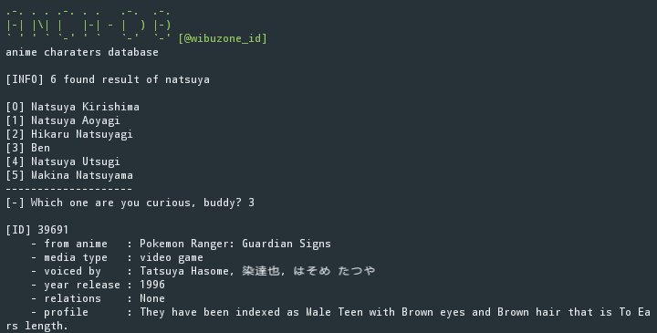
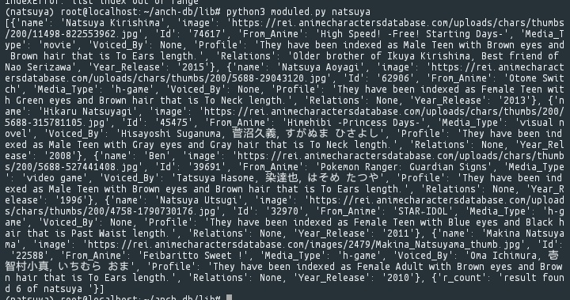

## about anch-db
This is a tool to scan anime characters along with a little information. 
This is the result of scraping from website <a href="https://animecharactersdatabase.com">here</a>

*because the api server from the default web has limited requests even though it can be 
handled with the express js module here with python can be free without limitations.
## Example Result

You can use it as a module in lib/ moduled.py if you can't compose it for your website. 

^ from modulename import anch_db  
^ anchdb.getinfo(your query)

with a return as below

## requirements
* pip3 install requests
  
